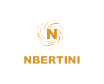

# Busqueda de productos
<p align="center"><a href="www.nicolas-bertini.com.ar" target="_blank" ></a></p>

## Titulo
Buscando se encuentra!

## Descripcion
Este es un proyecto desarrollado en NextJS con los servicios de la plataforma Fiberbase.
El proyecto lo desarrollé con el objetivo de practicar con NextJs, Hooks y Fiberbase. No lo hice con el objetivo de brindarle un buen diseño, por lo que no se encuentra desarrollado de manera responsive.
Este proyecto nos brindara la posibilidad de crearnos un usuario, crear nuestro propios productos, comentar y votar productos. Cuenta con políticas de administración para el propietario de cada producto.

## Requerimientos
Necesita instalar Visual Studio Code, luego clonar el repositorio de GitHub.
Crearnos una cuenta en la plataforma Fiberbase, iniciar un nuevo proyecto y luego de habilitar lo que es la autenticacion por correo debemos completar el archivo nex.config.js con los valores que nos brindaran.

## Comandos para correr el proyecto son:

```javascript
git clone URL
npm install
npm run dev
# or
yarn dev
```

First, run the development server:

```bash
npm run dev
# or
yarn dev
```

Ejecuta la aplicación en modo de desarrollo. Abra http://localhost:8080/ para verlo en el navegador.

La página se volverá a cargar si realiza modificaciones. 

### Puedes conocer más sobre la documentacion de NextJS en:

- [Documentación de Next.js] (https://nextjs.org/docs): obtenga información sobre las funciones y la API de Next.js.
- [Learn Next.js] (https://nextjs.org/learn): un tutorial interactivo de Next.js.

## Autor
Nicolás Bertini Argañaras - Desarrollador freelance

- Mi portafolio: https://www.nicolas-bertini.com.ar/
- Linkedin: www.linkedin.com/in/nicolas-bertini-argañaras
